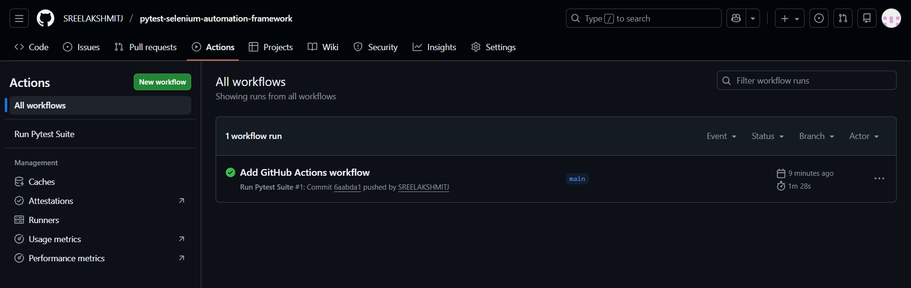
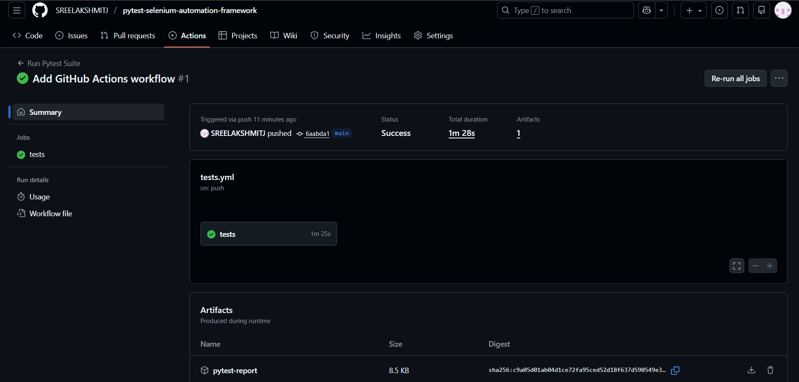
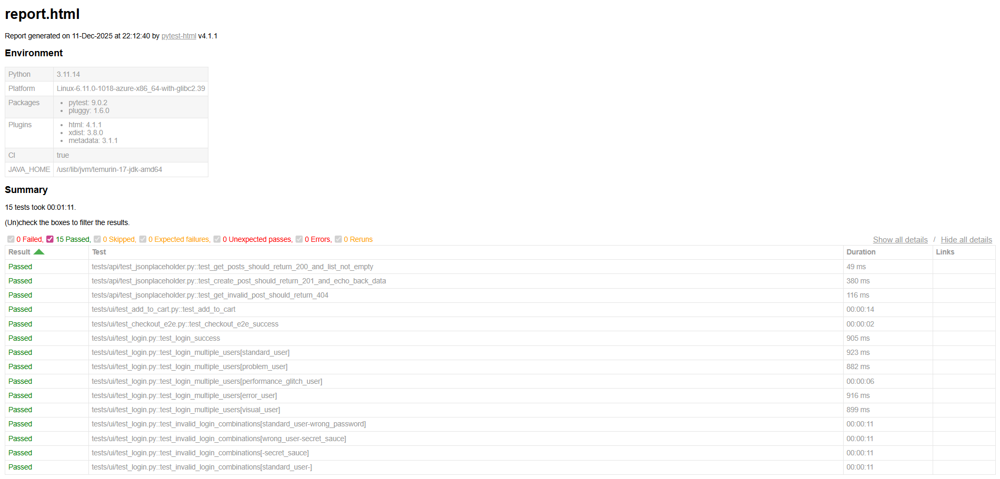

# Selenium Pytest Automation Framework

A complete, modular, and scalable UI Test Automation Framework built using Python, Selenium WebDriver, Pytest, and the Page Object Model (POM) design pattern.

This framework supports:

- Parallel execution

- HTML reporting

- Screenshots on failure

- Pytest fixtures

- Parametrized test data

- Clean POM structure

- Easy integration with CI/CD pipelines
  

## Repository URL
https://github.com/SREELAKSHMITJ/pytest-selenium-automation-framework.git

## Application Under Test (AUT)

This framework is built and tested using the public demo application:

**SauceDemo (https://www.saucedemo.com/)**  
A sample e-commerce site designed for UI automation practice and validating login, product listing, cart flow, and checkout features.

### Automated Scenarios

- Login (valid and invalid credentials)
- Product selection
- Add to Cart
- Cart verification
- Checkout process
- End-to-end order completion

## Features

1. Page Object Model (POM)

	Encapsulates page locators and actions for clean, maintainable test code.

2. Selenium + Pytest Integration

	Stable UI automation using Pytest test runner.

3. Screenshots on Failure

	Automatically captured under the screenshots/ folder.

4. HTML Reporting

		pytest --html=reports/report.html --self-contained-html

6. Parallel Execution Using xdist

		pytest -n 2

7. Pytest Fixtures

	Reusable setup/teardown logic.

7. Parametrized Test Cases

	Run multiple test data sets cleanly.

## API Testing

API testing is integrated into this project alongside Selenium UI automation to provide complete test coverage using:

- Python `requests` library
- Pytest for running and asserting tests
- A reusable `APIClient` helper (`utils/api_client.py`)
- Tests for public REST endpoints (JSONPlaceholder) covering GET, POST and negative scenarios

## Project Structure

	Selenium_Project/
	│
	├── pages/                
	│   ├── login_page.py
	│   ├── products_page.py
	│   ├── cart_page.py
	│   └── checkout_page.py
	│
	├── tests/  
	│   ├── conftest.py
	│   ├── api/
	│   	├──test_jsonplaceholder.py
	│   ├── ui/
	│   	├── test_login.py
	│   	├── test_add_to_cart.py
	│   	└── test_checkout_e2e.py
	│
	├── utils/    
	│   ├── api_client.py
	│   └── driver_setup.py
	│
	├── screenshots/          
	├── reports/              
	│
	├── requirements.txt
	└── README.md

## Installation

Clone the repository:

	git clone https://github.com/SREELAKSHMITJ/pytest-selenium-automation-framework.git

Navigate into the project:

	cd Selenium_Project

Install dependencies:

	pip install -r requirements.txt

## Running Tests

Run all tests

	pytest -v

Run with HTML report

	pytest -v --html=reports/report.html --self-contained-html

Run in parallel

	pytest -n 2

Run by markers

	pytest -m smoke
	pytest -m regression
	pytest -m "not slow"

Run only API tests

	pytest tests/api -v

## Screenshots on Failure

If a test fails, a screenshot is automatically saved in:

	screenshots/

This helps identify UI failures and debug issues quickly.

Example:

	screenshots/test_login_failure.png

## Example Test

	def test_login_success(driver):
    	login_page = LoginPage(driver)
    	login_page.open()
    	login_page.login("standard_user", "secret_sauce")

    	assert login_page.is_logged_in(), "User should be logged in"

## CI/CD (GitHub Actions)

This project uses **GitHub Actions** to automatically run the test suite on every push to `main`.

### CI Run Proof

**Workflow Success:**

**Report Artifact Generated:**

---

## Test Reporting (pytest-html)

**HTML Report Example:**

## Future Enhancements

- Logging using Python logging module

- GitHub Actions CI integration

- API testing module

- Allure reports

- External JSON/CSV test data

